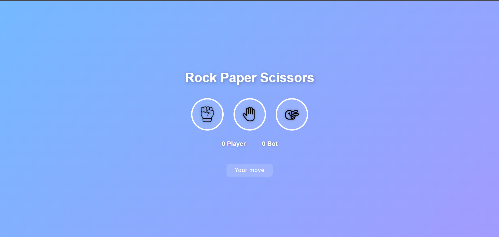

# Rock Paper Scissors Game 🎮

A simple **Rock-Paper-Scissors** game built with **HTML, CSS, and JavaScript**.  
Click an icon to make your move, the bot will pick a random move, and the winner is decided automatically.

---

## Features ✨
- Interactive buttons for **Rock, Paper, and Scissors**  
- Randomized bot moves  
- Real-time score updates  
- Hover and click effects on buttons  
- Simple and responsive design  
- Optional sound effects on clicks  

---

## Demo 🎥
  

---

## Getting Started 🚀

### 1. Clone the repository
```bash
git clone https://github.com/yourusername/rock-paper-scissors.git
cd rock-paper-scissors
